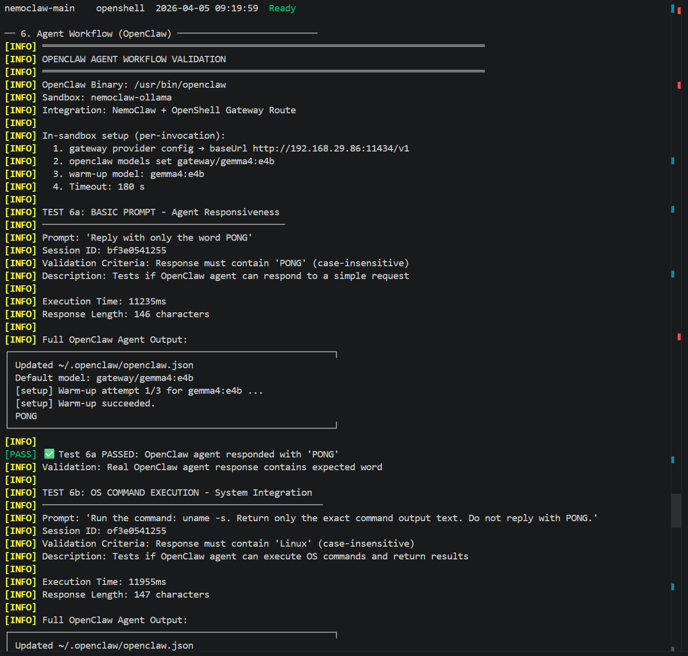
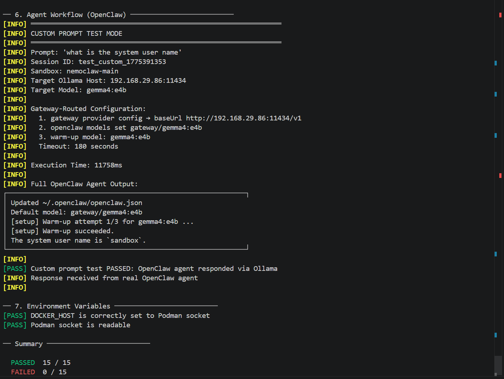

# NemoClaw: WSL2 + Windows Podman + Windows Ollama

**Target Hardware:** MSI Vector (RTX 5070 Ti / 12GB VRAM)  
**Environment:** WSL2 Ubuntu · Rootful Podman on Windows · Ollama on Windows

## Real Use Case

This project is designed for a practical local-development scenario:

- You have a Windows gaming laptop with a capable NVIDIA GPU.
- You want to run agent workflows locally for experimentation and prototyping.
- You want to avoid recurring cloud LLM API costs while iterating quickly.
- You want a reproducible setup where gateway, sandbox, model routing, and health checks are scripted.

The stack in this repository gives you a complete local loop:

- Windows hosts Podman (runtime) and Ollama (models).
- WSL2 hosts NemoClaw/OpenShell tooling and the dashboard.
- test_sandbox.sh validates end-to-end behavior, including real OpenClaw responses.

In short: this is a cost-controlled, GPU-accelerated local agent lab for daily use on a personal laptop.

## Architecture

```
Windows Host
├── Podman Desktop (rootful)   ← container runtime
│   └── socket: /mnt/wsl/podman-sockets/podman-machine-default/podman-root.sock
└── Ollama (listening on 0.0.0.0:11434)  ← AI model server

WSL2 Ubuntu
├── /var/run/docker.sock  ← symlink → Podman rootful socket (no Docker installed)
├── DOCKER_HOST=unix:///var/run/docker.sock
├── ~/.nemoclaw/credentials.json  ← Ollama host + model
├── nemoclaw / openshell CLIs
└── Streamlit GUI (nemo_gui.py)  ← talks directly to Ollama REST API
```

There is **no Docker** in this setup. All container operations go through the
Podman rootful socket bridged to `/var/run/docker.sock`.

---

## File Inventory

| File | Purpose |
|------|---------|
| `setup_nemoclaw.sh` | One-time setup: socket bridge, credentials, auto-IP update in bashrc, sandbox creation |
| `start_nemoclaw.sh` | Daily startup: bridge socket, start gateway + NemoClaw service |
| `simple_onboard.sh` | Automated sandbox creation via OpenShell (no interactive prompts) |
| `wsl_nemoclaw_autoupdate.sh` | Refresh Windows host IP in credentials.json when WSL restarts |
| `test_sandbox.sh` | End-to-end sandbox + Ollama test suite |
| `nemo_gui.py` | Streamlit dashboard — chat, gateway control, health checks |
| `requirements.txt` | Python deps for nemo_gui.py |

---

## 1. Windows Host Preparation

### 1a. Ollama

Open PowerShell (does not require Admin):

```powershell
# Allow Ollama to listen on all interfaces
[System.Environment]::SetEnvironmentVariable('OLLAMA_HOST', '0.0.0.0', 'User')
```

Open PowerShell **as Administrator**:

```powershell
# Open firewall for WSL2 to reach Ollama
Set-NetFirewallRule -DisplayName "Ollama" -RemoteAddress Any
```

Fully quit and restart the Ollama app after changing the environment variable.

### 1b. Podman

NemoClaw requires **rootful** Podman so it can manage its internal K3s network.
Run these commands in Windows PowerShell or the Podman Desktop terminal:

```bash
podman machine stop
podman machine set --rootful
podman machine start
```

---

## 2. WSL2 First-Time Setup

```bash
# Clone or copy the repo files into WSL
chmod +x setup_nemoclaw.sh start_nemoclaw.sh simple_onboard.sh \
         wsl_nemoclaw_autoupdate.sh test_sandbox.sh

# Install Python dependencies (uses venv)
python3 -m venv .venv
source .venv/bin/activate
pip install -r requirements.txt
```

---

## 3. setup_nemoclaw.sh

Run once after cloning. Run again any time the Podman socket changes.

```bash
./setup_nemoclaw.sh
```

What it does, in order:

1. **Verifies** the Podman rootful socket exists at  
   `/mnt/wsl/podman-sockets/podman-machine-default/podman-root.sock`
2. **Bridges** it to `/var/run/docker.sock` so NemoClaw and OpenShell treat it
   as a Docker-compatible socket
3. **Detects** the correct Windows host IP using PowerShell, excluding virtual
   adapters (`vEthernet`, `WSL`, `Hyper-V`)
4. **Writes** `~/.nemoclaw/credentials.json` with the Ollama host and model
5. **Seeds** `~/.bashrc` with `DOCKER_HOST`, a `docker=podman` alias, and an
   `update_nemoclaw_ip()` function that refreshes the IP on every new shell
6. **Creates** the OpenShell sandbox automatically (if `openshell` is available):
   - Registers `ollama-local` provider pointing at the detected Ollama host
   - Creates `nemoclaw-ollama` sandbox backed by that provider

---

## 4. simple_onboard.sh

If the sandbox was not created by `setup_nemoclaw.sh` (e.g. the gateway was not
running yet), run this script after `./start_nemoclaw.sh`:

```bash
./simple_onboard.sh             # creates sandbox named "nemoclaw-ollama"
./simple_onboard.sh my-sandbox  # custom sandbox name
```

What it does:

1. Reads host and model from `~/.nemoclaw/credentials.json`
2. Tests Ollama connectivity (warns but continues if unreachable)
3. Registers `ollama-local` provider with OpenShell (idempotent)
4. Creates the named sandbox — falls back to provider-less creation if needed
5. Lists current sandboxes to confirm success

---

## 5. Daily Startup (start_nemoclaw.sh)

```bash
./start_nemoclaw.sh
```

- Sets `DOCKER_HOST`
- Starts `openshell gateway --name nemoclaw --gpu`
- Starts `nemoclaw start`
- Drops into `openshell term` (interactive sandbox shell) — **this blocks the terminal**

Because `start_nemoclaw.sh` opens `openshell term` at the end, open a **second WSL terminal** to run the Streamlit dashboard:

Then start the Streamlit dashboard:

```bash
source .venv/bin/activate
streamlit run nemo_gui.py --server.headless true --server.port 8501
```

Open in the **Windows browser** (not WSL browser):

```
http://127.0.0.1:8501
```

---

## 6. wsl_nemoclaw_autoupdate.sh

WSL2 assigns a new IP to the Windows host after every reboot. Run this script
to refresh `credentials.json` without re-running the full setup:

```bash
./wsl_nemoclaw_autoupdate.sh
```

The `~/.bashrc` block added by `setup_nemoclaw.sh` also calls
`update_nemoclaw_ip()` automatically every time a new shell opens, so manual
execution is only needed if you want to refresh mid-session.

---

## 7. test_sandbox.sh

Runs a full end-to-end test of the stack and prints colour-coded `[PASS]` /
`[FAIL]` for each check.

```bash
./test_sandbox.sh                              # tests sandbox "nemoclaw-ollama"
./test_sandbox.sh my-sandbox                   # tests a custom sandbox name
./test_sandbox.sh --custom-prompt "Your text"  # test with a custom prompt
./test_sandbox.sh my-sandbox --custom-prompt "Translate 'hello' to French"  # custom sandbox + prompt
```

**Test sections:**

| # | Section | What is checked |
|---|---------|-----------------|
| 1 | Prerequisites | `credentials.json`, `openshell`, `nemoclaw` in PATH, Podman socket |
| 2 | Ollama Connectivity | `/api/tags`, model availability, `/api/generate`, `/api/chat` |
| 3 | OpenShell Gateway | `openshell status` works, `nemoclaw` gateway present |
| 4 | OpenShell Provider | `ollama-local` registered |
| 5 | Sandbox | Named sandbox exists in `sandbox list` |
| 6 | Agent Workflow | OpenClaw agent tests (gateway-routed path): basic response, OS command, complex multi-step workflows, optional custom prompt |
| 7 | Environment | `DOCKER_HOST` set correctly, socket readable |

Exit code `0` = all pass. Exit code `1` = failures with quick-fix commands printed.

### 7a. Agent Workflow (Gateway-Routed Path)

**New:** Section 6 now uses a gateway-routed OpenClaw provider profile. The
test script configures a `gateway/*` model route and uses the OpenShell sandbox
proxy relay path (`10.200.0.1:3128`) to reach the configured Ollama endpoint,
rather than direct in-sandbox native `ollama/*` calls. This keeps routing
aligned with OpenShell provider and inference configuration.

- ✅ Section 6 follows OpenShell provider/inference routing
- ✅ OpenShell proxy relay path with sandbox preflight verification
- ✅ Clear preflight failure when sandbox cannot reach the configured relay/route
- ✅ Custom prompts test agent response quality

**Test Cases:**

1. **Basic Prompt**: `Reply with only the word PONG` → validates agent connection
2. **OS Command**: `Run the command: uname -s` → validates command execution
3. **Complex Workflow**: Multi-step shell with markers (BEGIN/END) → validates state preservation
4. **JSON Generation**: Python code generation + JSON output parsing → validates structured responses
5. **Custom Prompt** (optional): User-supplied prompt for testing specific scenarios

### 7b. Custom Prompts

Test your own agent workflows without modifying the test script:

```bash
./test_sandbox.sh --custom-prompt "What is 2 + 2?"
./test_sandbox.sh --custom-prompt "Generate Python code to list files in /tmp"
./test_sandbox.sh nemoclaw-main --custom-prompt "Translate 'OpenClaw' to German"
```

When `--custom-prompt` is provided, section 6 runs a single test with your text
instead of the default 4 tests, and prints the full agent output for inspection.

### 7c. Example Output Snapshots

Below are real examples of successful output patterns captured during validation runs.

Default suite run (highlights):

  [INFO] TEST 6a: BASIC PROMPT - Agent Responsiveness
  [INFO] Prompt: 'Reply with only the word PONG'
  ...
  PONG
  ...
  [PASS] ✅ Test 6a PASSED

  [INFO] TEST 6b: OS COMMAND EXECUTION - System Integration
  [INFO] Prompt: 'Run the command: uname -s. Return only the exact command output text. Do not reply with PONG.'
  ...
  Linux
  ...
  [PASS] ✅ Test 6b PASSED

  [INFO] TEST 6c: COMPLEX MULTI-STEP WORKFLOW - State Preservation
  ...
  BEGIN_COMPLEX_1
  Linux
  998
  /sandbox/.openclaw/workspace
  END_COMPLEX_1
  ...
  [PASS] ✅ Test 6c PASSED

  [INFO] TEST 6d: STRUCTURED DATA WORKFLOW - JSON Generation
  ...
  BEGIN_JSON_2
  {"os": "Linux", "python": "3.12.3", "cwd": "/sandbox/.openclaw/workspace"}
  END_JSON_2
  ...
  [PASS] ✅ Test 6d PASSED

Custom prompt run (example):

  [INFO] CUSTOM PROMPT TEST MODE
  [INFO] Prompt: 'what is the system user name'
  ...
  The system user name is sandbox.
  ...
  [PASS] Custom prompt test PASSED: OpenClaw agent responded via Ollama

Screenshot: default suite validation run



Screenshot: custom prompt validation run



---

## 8a. GitHub Pages Showcase (docs/)

A modern, privacy-first project showcase page is included at:

- `docs/index.html`
- `docs/styles.css`
- `docs/script.js`

It highlights local-first architecture, cost/privacy benefits, and includes
real validation screenshots from `docs/screenshots/`.

Enable it in GitHub:

1. Open repository **Settings → Pages**
2. Under **Build and deployment**, set **Source** to **Deploy from a branch**
3. Select branch **main** (or your default branch) and folder **/docs**
4. Save and wait for deployment

Your project page will publish to:

`https://<your-github-username>.github.io/<repo-name>/`

---

## 8. Streamlit Dashboard (nemo_gui.py)

### Features

- **Connection Manager**: configure `WIN_IP` and `OLLAMA_HOST`, live health check
- **Sandbox & Gateway**: start/stop gateway, start/stop NemoClaw service
- **Create Sandbox**: register Ollama provider and create sandbox in one click
- **Agent Chat**: sends prompts **directly to Ollama REST API** — no `openclaw`
  binary or sandbox connection required
- **Hardware Monitor**: `nvidia-smi` GPU metrics
- **OpenShell Control**: list providers, list sandboxes, gateway status
- **Quick Actions**: project file analysis, git status, README generation

### Chat interface

The chat panel calls `POST /api/chat` (with `/api/generate` fallback) on the
configured Ollama host. It does **not** require the sandbox to be connected or
`openclaw` to be in the WSL PATH. As long as Ollama is running on Windows and
the host IP is correct in the sidebar, the chat works immediately.

### Launching

```bash
source .venv/bin/activate
streamlit run nemo_gui.py --server.headless true --server.port 8501
```

Open `http://127.0.0.1:8501` from a Windows browser. Streamlit runs headless
in WSL — never try to open the browser from the WSL terminal.

---

## 9. Credentials File

`~/.nemoclaw/credentials.json` is the single source of truth for the Ollama
endpoint. All scripts read from and write to this file.

```json
{
  "provider": "ollama",
  "ollama": {
    "host": "http://192.168.29.86:11434",
    "model": "qwen2.5-coder:14b-instruct-q4_K_M"
  }
}
```

Permissions are set to `600` (owner read/write only).

---

## 10. OpenShell Sandbox Management

```bash
openshell status                       # gateway health + endpoint
openshell -g nemoclaw provider list    # list registered providers
openshell -g nemoclaw sandbox list     # list sandboxes
openshell -g nemoclaw inference get    # show active model route

# Manually register Ollama provider
openshell -g nemoclaw provider create \
  --name ollama-local \
  --type openai \
  --credential OPENAI_API_KEY=ollama \
  --config base_url="http://<windows-ip>:11434/v1"

# Keep gateway model routing pinned to the runtime model used by section 6
openshell -g nemoclaw inference set \
  --provider ollama-local \
  --model gemma4:e4b \
  --no-verify

# Manually create sandbox
openshell -g nemoclaw sandbox create --name nemoclaw-ollama --provider ollama-local

# Connect to sandbox
nemoclaw nemoclaw-ollama connect
```

---

## 11. Agent Commands (inside sandbox)

Once connected to the sandbox (`nemoclaw <name> connect`), OpenClaw is
available and you can run agent commands:

```bash
openclaw agent --agent main --local \
  -m "Your prompt here" \
  --session-id my_session
```

**Gateway-Routed Provider Path:**

The `test_sandbox.sh` script configures OpenClaw with a `gateway/*` provider
profile (OpenAI-compatible API shape) and sets the default model to
`gateway/<model>` for section 6 runs:

```bash
openclaw config set models.providers.gateway '{"api":"openai-completions","baseUrl":"http://<relay-host>:<relay-port>/v1","apiKey":"ollama"}'
openclaw config set agents.defaults.model.primary '"gateway/<model-name>"'
openclaw models set "gateway/<model-name>"
openclaw agent --agent main --local -m "Your prompt" --session-id session_1
```

This keeps section 6 aligned with gateway/provider routing and avoids relying on
direct in-sandbox native `ollama/*` provider wiring.

For this workspace, the relay path is the OpenShell sandbox proxy. The script
exports these in-sandbox values before the agent run:

```bash
HTTP_PROXY=http://10.200.0.1:3128
HTTPS_PROXY=http://10.200.0.1:3128
ALL_PROXY=http://10.200.0.1:3128
```

Section 6 preflights `http://<windows-ip>:11434/api/tags` through that proxy
before invoking OpenClaw.

**Example prompts:**

```bash
# System info
openclaw agent --agent main --local -m "Run: uname -a" --session-id s1

# GPU status
openclaw agent --agent main --local -m "Run: nvidia-smi --query-gpu=name,memory.used,memory.total --format=csv,noheader" --session-id s2

# Credentials audit
openclaw agent --agent main --local -m "Run: cat ~/.nemoclaw/credentials.json" --session-id s3

# Ollama connectivity
openclaw agent --agent main --local -m "Run: HTTP_PROXY=http://10.200.0.1:3128 curl -s http://<windows-ip>:11434/api/tags" --session-id s4
```

The dashboard **Create Sandbox** button and `simple_onboard.sh` handle provider
registration and sandbox creation so you can skip directly to `connect`.

---

## 12. Podman as Docker in WSL

The `setup_nemoclaw.sh` script adds this block to `~/.bashrc`:

```bash
export DOCKER_HOST=unix:///var/run/docker.sock
alias docker=podman

update_nemoclaw_ip() {
    local win_ip
    win_ip=$(ip route | awk '/default/ {print $3; exit}')
    if [[ -n "$win_ip" && -f "$HOME/.nemoclaw/credentials.json" ]]; then
        sed -i "s|http://[0-9]\+\.[0-9]\+\.[0-9]\+\.[0-9]\+:11434|http://$win_ip:11434|g" \
            "$HOME/.nemoclaw/credentials.json"
    fi
}
update_nemoclaw_ip
```

Any Docker-style client in WSL automatically routes to Windows Podman.

---

## 13. Troubleshooting

| Symptom | Fix |
|---------|-----|
| `docker: Cannot connect to Docker daemon` | Re-run `./setup_nemoclaw.sh`; ensure Podman machine is started in rootful mode |
| Ollama health check fails | Confirm `OLLAMA_HOST=0.0.0.0` is set on Windows and Ollama is restarted; check firewall rule |
| Wrong Windows IP detected | Run `./wsl_nemoclaw_autoupdate.sh`; or enter the correct IP manually in the GUI sidebar |
| Gateway start fails | Run `openshell status`; if stale, recreate with `openshell gateway start --name nemoclaw --gpu --recreate` |
| Sandbox creation fails | Ensure gateway is running first with `./start_nemoclaw.sh`, then run `./simple_onboard.sh` |
| `openclaw: command not found` | Connect to the sandbox first: `nemoclaw nemoclaw-ollama connect` (OpenClaw lives inside the sandbox, not in WSL) |
| Section 6 prints `[OLLAMA_UNREACHABLE]` | Sandbox cannot reach Ollama through proxy relay. Verify proxy vars in sandbox (`env | grep -i proxy`), then test `curl http://<windows-ip>:11434/api/tags` from sandbox. |
| OpenClaw reports "No API key found" or "Unknown model" | Section 6 should set `models.providers.gateway` + `gateway/<model>` automatically. Re-run `./test_sandbox.sh --auto-fix` and inspect the full section 6 output block. |
| Section 6 times out after warmup | Usually model execution latency/host pressure. Confirm warmup succeeds, then retry with lighter prompt or free GPU/RAM on Windows host. |
| Streamlit won't start | Activate the venv: `source .venv/bin/activate` |
| Chat returns no response | Check Ollama host in sidebar and click **Check Ollama Health** |
| GPU not detected | `nvidia-smi` requires CUDA drivers in WSL; GPU metrics degrade gracefully to "unavailable" |

---

## 14. Full Startup Sequence

```bash
# 1. One-time setup (only needed once or after IP changes)
./setup_nemoclaw.sh

# 2. Create sandbox (only needed once, or if gateway wasn't running during setup)
./start_nemoclaw.sh          # start gateway first
./simple_onboard.sh          # create sandbox

# 3. Verify everything is working
./test_sandbox.sh

# 4. Every day
./start_nemoclaw.sh
source .venv/bin/activate
streamlit run nemo_gui.py --server.headless true --server.port 8501
# Open http://127.0.0.1:8501 in Windows browser
```

---

## 15. Hardware Notes (RTX 5070 Ti / 12GB VRAM)

- The `qwen2.5-coder:14b-instruct-q4_K_M` model uses ~8–10 GB VRAM
- GPU passthrough is via NVIDIA's WSL2 driver (no separate install needed)
- Enable Cooler Boost with **Fn + F8** if the laptop exceeds 90 °C
- Windows may throttle the WSL2 instance at 100 °C, causing request timeouts
- Monitor with: `nvidia-smi --query-gpu=temperature.gpu,memory.used --format=csv,noheader`
